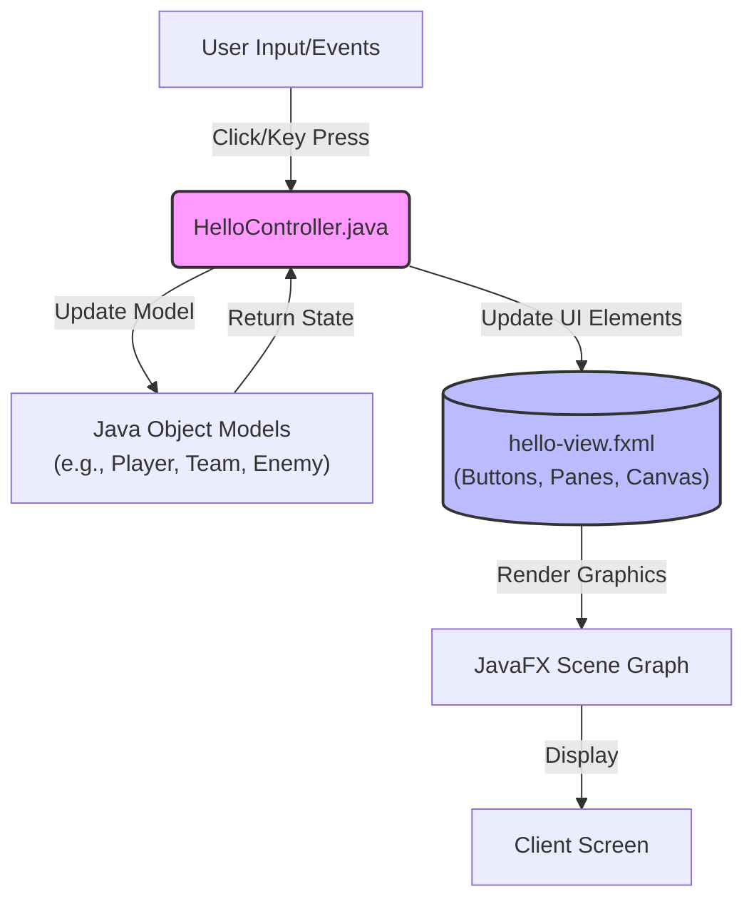

<!-- REPLACE: To use a custom logo, replace the capsule-render URL below with your raw image URL -->

<h1>University Activity: Computer Science Academic Portfolio</h1>

[;Advanced+Algorithm+Design;Object-Oriented+Programming)](https://git.io/typing-svg)

<!-- Badges -->

<!-- ASSUMPTION: Adding an MIT License badge as it is the industry standard for developer portfolios to allow recruiters/peers to safely review the code. -->

 

<!-- Action Buttons -->
[**Explore Projects**](#-about-the-project) · [**View Source Code**](https://github.com/Amkhodaei83/University-Activity) · [**Report Bug**](https://github.com/Amkhodaei83/University-Activity/issues)

---

## 📑 Table of Contents

<strong>Expand to view full navigation</strong>

1. [About The Project](#-about-the-project)
2. [Demo & Visuals](#-demo--visuals)
3. [Getting Started](#-getting-started)
4. [Usage & Academic Roadmap](#-usage--academic-roadmap)
5. [API & Project Reference](#-api--project-reference)
6. [Roadmap](#-roadmap)
7. [Contributing](#-contributing)
8. [License](#-license)
9. [Contact & Acknowledgments](#-contact--acknowledgments)

---

## 🚀 About The Project

The **University Activity** repository is a comprehensive computer science portfolio documenting five complete semesters of academic progression and software engineering development. Rather than a single application, this repository serves as a chronological vault—tracing the evolution from procedural logic in C++ to building complex JavaFX graphical interfaces and solving advanced competitive programming challenges. 

By centralizing everything from fundamental data structures to dynamic programming and graph algorithms, this repository demonstrates a deep, practical mastery of computer science concepts, algorithmic efficiency, and object-oriented design patterns.

### ✨ Key Competencies Demonstrated

*   **Procedural & Low-Level Logic:** Foundational mathematics, array manipulations, and search algorithms written in raw C++.
*   **Object-Oriented Design (OOP):** Complex domain modeling in Java, including abstract classes, inheritance, and encapsulation (e.g., the `Soccer` league management system).
*   **Graphical User Interfaces (GUI):** Extensive use of JavaFX and FXML to build interactive desktop applications, complete with animations, event handling, and custom controllers (e.g., *Clock*, *Mario*, *Rain*).
*   **Advanced Data Structures:** Implementation of Red-Black Trees, Priority Queues, Linked Lists, Graphs, and Abstract Syntax Trees.
*   **Algorithm Design Patterns:** Sophisticated problem-solving utilizing Backtracking, Branch and Bound, Divide and Conquer, Dynamic Programming, and Greedy algorithms.
*   **Competitive Programming:** Heavily optimized solutions for International Collegiate Programming Contest (ICPC) algorithmic challenges.

### 🛠️ Tech Stack & Tools

*The technologies powering the projects within this academic archive:*

## 📸 Demo & Visuals

The sheer volume of projects within this archive makes a single demo impossible. However, the crown jewels of this repository are the JavaFX graphical applications built during the `Advanced Programing Workshop`. 

### 🏗️ Architecture Overview: JavaFX Application Structure

The advanced GUI projects follow a consistent Model-View-Controller (MVC) architectural pattern using JavaFX and FXML. This ensures a clean separation of concerns between the business logic, the visual layout, and user interactions.

---

## 🚀 Getting Started

To explore, run, or build upon the academic projects within this repository, follow these setup instructions. 

### 📋 Prerequisites

Before cloning the repository, ensure your development environment is equipped with the following:

*   **Java Development Kit (JDK) 21+**: Essential for compiling and running the Java and JavaFX projects. [Download JDK](https://adoptium.net/)
*   **C++ Compiler**: `g++` (GCC) or equivalent for the Semester 1 procedural logic files.
*   **Apache Maven**: Required to handle dependencies for the advanced JavaFX applications. [Download Maven](https://maven.apache.org/)

### 🛠️ Installation & Setup

1. **Clone the repository** to your local machine:
   <kbd>git clone https://github.com/Amkhodaei83/University-Activity.git</kbd>

2. **Navigate to the project directory**:
   <kbd>cd University-Activity</kbd>

3. **Running the JavaFX Projects (Maven)**
   To execute any of the advanced GUI projects (e.g., the `clock` app):
   <kbd>cd "semester 2/Advanced Programing Workshop/clock"</kbd>
   <kbd>mvn clean javafx:run</kbd>

4. **Compiling C++ Files**
   To test foundational logic files (e.g., `first_code.cpp`):
   <kbd>cd "semester 1/computer basics"</kbd>
   <kbd>g++ first_code.cpp -o first_code</kbd>
   <kbd>./first_code</kbd>

### ⚙️ Environment Configuration

While most scripts are standalone, the advanced JavaFX projects rely on `pom.xml` configurations. Ensure your IDE (IntelliJ IDEA, Eclipse, or VS Code) is configured to recognize Maven dependencies automatically. No external API keys or secret environment variables are required to run this repository.

---

## 📖 Usage & Academic Roadmap

This repository is structured chronologically, mirroring a rigorous computer science curriculum. Each folder represents a distinct phase of technical growth.

### Semester 1: Computer Basics (C++)
The genesis of the repository. This section focuses on mastering the syntax, control structures, and memory management of C++.
*   **Key Implementations**: Arrays, pointers, sorting algorithms (Bubble Sort), linear searches, mathematical computations (Factorials, Fibonacci sequence), and pattern generation using loops.
*   **Usage Example**: The `cheat sheet/all.cpp` file acts as a massive utility library containing nearly every foundational algorithm learned in the course.

### Semester 2: Object-Oriented Design & GUIs (Java & JavaFX)
A massive leap into high-level, object-oriented programming. 
*   **Core OOP**: The `Advanced Programing/socer` directory contains a robust league management system, demonstrating classes, encapsulation, lists, and inter-object communication (`Player` and `Team` models).
*   **JavaFX Workshop**: Over 15 distinct JavaFX projects demonstrating mastery over timelines, keyframe animations, FXML controllers, scene switching, and interactive canvas manipulation (e.g., drawing tools, animated clocks, and mini-games like *Mario* and *Enemy Spawners*).

### Semester 3: Data Structures & Algorithms
The rigorous theoretical core of computer science.
*   **Structures**: Implementation of custom `LinkedList`, `PriorityQueue`, and complex `RedBlackTree` structures from scratch.
*   **Algorithms**: Deep dives into graph theory (Strongly Connected Components via Tarjan's/Kosaraju's algorithms), Tree traversing, and algorithmic problem solving for ICPC preparation.

### Semester 4: Advanced Algorithm Design
Focused on optimizing solutions and understanding algorithmic paradigms.
*   **Paradigms Covered**: 
    *   **Dynamic Programming**: `shekarchi` (Hunter) board-state optimization.
    *   **Greedy Algorithms**: Maximizing quotients and efficient pathing.
    *   **Divide and Conquer**: Advanced array merging and sorting.
    *   **Branch and Bound**: Solving the Job Assignment Problem (JAP) with cost matrices.
    *   **Backtracking**: Complex set partitioning logic.

### Semester 5: Competitive Programming (ICPC Training)
Heavily optimized, fast-I/O Java solutions designed specifically for competitive programming environments. These scripts utilize custom `FastReader` classes to parse massive datasets rapidly.

## 📚 API & Project Reference

Due to the repository acting as an academic vault rather than a single software product, there is no centralized REST API. Instead, there is a massive collection of utility classes, algorithmic implementations, and object models. 

Below is a reference guide to the core components found in the advanced Java and JavaFX projects.

<strong>👉 JavaFX Controllers & Visual Models (Expand for Details)</strong>

### The Advanced Programming Workshop (JavaFX)

The `semester 2/Advanced Programing Workshop` contains a series of interactive applications. The most notable controllers and logic implementations include:

#### 1. The Clock Application (`com.example.clock`)
*   **`HelloController.java`**: The main entry point. Initializes a dual-function UI (Stopwatch & Timer) utilizing `SpinnerValueFactory` for user input. It handles scene switching gracefully when buttons are clicked.
*   **`timer_controller.java`**: Implements a `Timeline` and `KeyFrame` object set to trigger every 1000ms (`Duration(1000)`).
*   **`stopwatch_controller.java`**: Manages the stopwatch pane and state.

#### 2. The Interactive Drawer (`com.example.demo`)
*   **`Arrow.java`**: A complex mathematical class that dynamically draws and calculates bezier curves (`QuadCurve`) and polygons (`arrowHead`). It features real-time control point dragging, distance calculations (`distanceToPoint`), and dynamic arrowhead rotation using `Math.atan2`.
*   **`CurvedArrowDrawer.java`**: The primary `Pane` that handles mouse events (`PRIMARY` for drawing, `SECONDARY` for selecting) and manages a `List<Arrow>` object to track all user-drawn elements.

#### 3. The Mini-Games (`com.example.demo9` & `com.example.demo10`)
*   **`player.java` & `enemy.java`**: Object-oriented models for game entities. Both feature `ImageView` management, bounding box detection (`intersects`), and internal `move()` methods using JavaFX `Timeline` to animate sprites across the screen continuously.
*   **`HelloController.java` (Game Logic)**: The game loop. It handles `KeyCode.SPACE` inputs to trigger "jump" animations (using `KeyValue` and `KeyFrame` to manipulate the Y-property of the player). It also manages collision detection via the `checkConflict()` method running on a 50ms loop.

<strong>👉 Advanced Algorithms & Data Structures (Expand for Details)</strong>

### The Data Structures Core (Semester 3 & 4)

The raw implementation of complex data structures and algorithmic paradigms from scratch without relying on the Java Standard Library.

#### 1. The Custom Red-Black Tree (`rangitree.java`)
*   **Implementation**: A fully functional Red-Black Tree (`RedBlackTree` class) built with custom `Node` objects tracking `value`, `color` ('r' or 'b'), `left`, `right`, and `parent`.
*   **Key Methods**: Features robust `leftRotate()`, `rightRotate()`, `insert()`, and complex `fixInsert()` and `fixDelete()` methods to maintain the strict balancing rules of the structure.

#### 2. Graph Theory: Strongly Connected Components (`osve.java`)
*   **Implementation**: Tarjan's algorithm for finding Strongly Connected Components (SCCs) in a directed graph.
*   **Key Methods**: Uses a recursive `dfs()` method tracking `lowLinkValues`, `componentMarkers`, and an `onStack` boolean array to accurately identify isolated clusters of vertices within an adjacency list.

#### 3. Algorithmic Paradigms (Semester 4)
*   **Dynamic Programming (`shekarchi`)**: Calculates the optimal path and "highest score" on a 2D grid (`mainGameBoard`) by memoizing previously calculated states in a `calculatedScores` array to prevent redundant computation in the `getMaxKillsFromThisPosition()` recursive function.
*   **Branch and Bound (`JAP`)**: Solves the Job Assignment Problem by maintaining a `Map` of states and evaluating the `calculateBound()` to prune inefficient exploration paths aggressively.

---

## 🗺️ Roadmap

The repository serves as a completed historical record of academic progress. However, future improvements to the repository structure and code quality are always possible.

- [x] Complete Semester 1 (Procedural C++)
- [x] Complete Semester 2 (OOP & JavaFX GUIs)
- [x] Complete Semester 3 (Data Structures)
- [x] Complete Semester 4 (Algorithm Design)
- [x] Complete Semester 5 (ICPC Competitive Programming)
- [ ] Add rigorous unit testing (JUnit) to the Java algorithms.
- [ ] Refactor the C++ procedural logic into object-oriented models.
- [ ] Add detailed inline documentation (JavaDoc) for the advanced data structures.
- [ ] Implement CI/CD pipelines via GitHub Actions to verify Maven builds automatically.

---

## 🤝 Contributing

While this is primarily a personal academic portfolio, suggestions for algorithmic optimizations or GUI improvements are welcome. 

### Development Setup

1.  Fork the Project
2.  Create your Feature Branch (`git checkout -b feature/OptimizedAlgorithm`)
3.  Commit your Changes (`git commit -m 'Add: Memoization to Fibonacci script'`)
4.  Push to the Branch (`git push origin feature/OptimizedAlgorithm`)
5.  Open a Pull Request

Please ensure any new JavaFX implementations successfully build using the default Maven `pom.xml` configuration provided in the respective directories.

---

## 📜 License

Distributed under the MIT License. See `LICENSE` for more information.

---

## 📬 Contact & Acknowledgments

**Project Author**: [amir-hossein-khodae](https://github.com/amir-hossein-khodae)

### Acknowledgments

*   **University Faculty**: For the rigorous curriculum defining these semesters.
*   [JavaFX](https://openjfx.io/) — The powerful framework enabling the graphical interfaces.
*   [Shields.io](https://shields.io) — For the repository badges.

  

